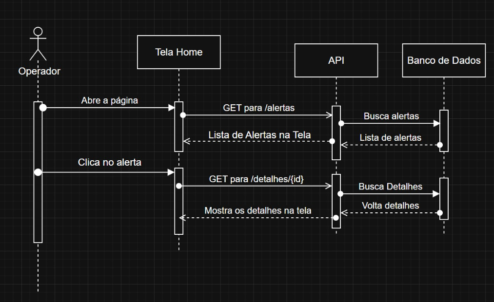

| Artefato                 | Valor |
|--------------------------|-------|
| Caso de Uso              | 1.0   |
| Diagrama de Atividade    | 1.0   |
| Diagrama de Sequência    | 1.0   |
| Documentação API (Basico)| 0.4   |
| Entregas                 | 0.5   |
| Guia de Estilo (- Fonte) | 0.4   |
| Login (SEM API)          | 0.8   |
| Tela de Bloqueio         | 0.7   |
| SQL Novo com dados       | 0.7   |
| Filtros Status           | 1.2   |
| Listagem                 | 0.9   |
| Filtros Prioridade       | 1.2   |

# Caso de Uso


# Diagrama de Atividade


# Diagrama de Sequência



# Ver Senha

```cs
private void OnButtonClick(object sender, EventArgs e)
{
  // Remove temporariamente o PasswordChar
  textBox1.PasswordChar = '\0';

 // Usa explicitamente o Timer do Windows  Forms
 System.Windows.Forms.Timer timer = new  System.Windows.Forms.Timer();
 timer.Interval = 5000; // 5 segundos
 timer.Tick += (s, args) =>
 {
    textBox1.PasswordChar = '*';
    timer.Stop();
    timer.Dispose();
 };
 timer.Start();
} 
```


# Bloquear Login

```cs
int tentativas = 0;
private void OnButtonClick(object sender, EventArgs e)
{
  // Login
  if (deuerrado)
  {
    // Mostra mensagem
    tentativas++;
  }

  if (tentaivas == 2)
  {
    // Usuários bloqueados
    // Colocar o nome do usuário na clásica estática
  }
} 
```
