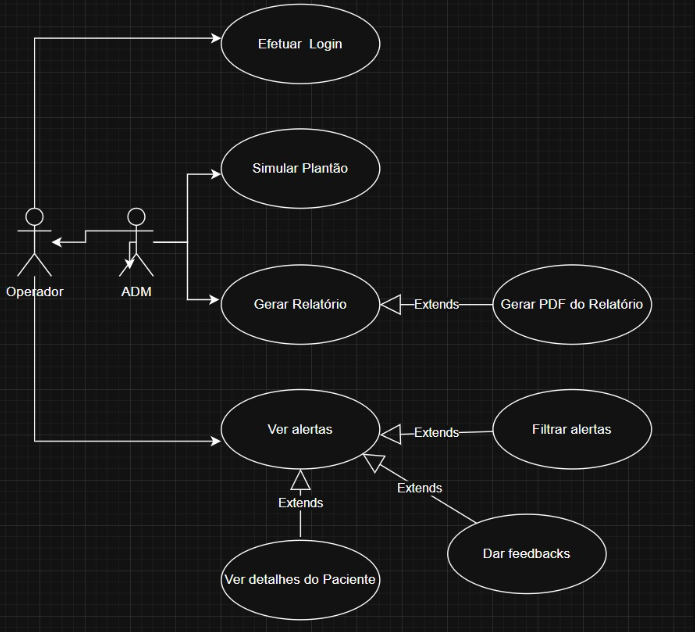
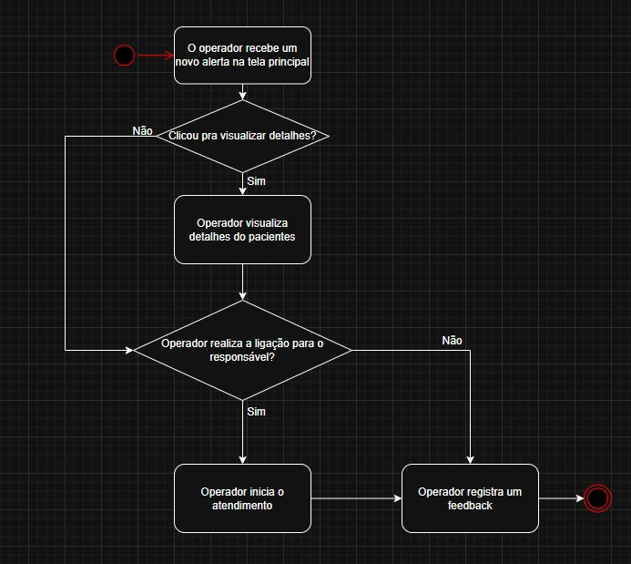

| Artefato                 | Valor |
|--------------------------|-------|
| Entregas                 | 0.5   |
| Guia de Estilo (- Fonte) | 0.4   |
| SQL Novo                 | 0.4   |
| SQL Normalizado          | 0.3   |
| Documentação API (Basico)| 0.4   |
| SQL Carrega dados        | 0.3   |
| Caso de Uso              | 1.0   |
| Diagrama de Atividade    | 1.0   |
| Diagrama de Sequência    | 1.0   |
| Login                    | 1.0   |
| Relatório                | 0.5   |
| Filtros Status           | 1.2   |
| Listagem                 | 0.9   |
| Filtros Prioridade       | 1.2   |

# Caso de Uso

# Diagrama de Atividade

