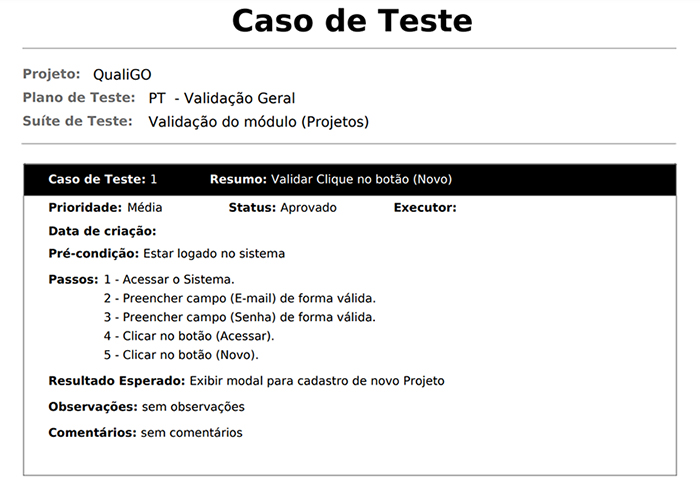

| Artefato                 | Valor |
|--------------------------|-------|
| Entregas                 | 0.8   |
| Guia de Estilo (-Fonte)  | 0.4   |
| Gerenciar de Avaliações  | 2.3   |
| Teste de Unidade         | 2.0   |
| Teste Funcional          | 2.0   |
| Nova Avaliação           | 1.7   |

# Deletar Multiplos

```cs
KeyPreview = true;
```

```cs
private void Form1_KeyDown(object sender, KeyEventArgs e)
{
    var db = new Banco();

    if (e.KeyCode == Keys.Delete)
    {
        DialogResult d = MessageBox.Show("Tem certeza da exclusão?", "Aviso", 
            MessageBoxButtons.YesNo, MessageBoxIcon.Question);

        if (d == DialogResult.No)
            return;
                
        foreach (DataGridViewRow item in dataGridView2.SelectedRows)
        {
            int id = (int)item.Cells[0].Value;
            var avalia = db.AvaliacaoRisco.FirstOrDefault(x => x.Id == id);
            db.AvaliacaoRisco.Remove(avalia);
            Deletados.deletados.Add(avalia);
        }

        db.SaveChanges();
        CarregaDataDrid();
    }

    if (e.KeyCode == Keys.Z && e.Control)
    {
        foreach (var item in Deletados.deletados)
            db.AvaliacaoRisco.Add(item);
        Deletados.deletados.Clear();
        
        db.SaveChanges();
        CarregaDataDrid();
    }
}
```

# Caso de Teste



# Testes

```cs
using System;
using Microsoft.VisualStudio.TestTools.UnitTesting;

public class RiscoService
{
    public double CalcularNotaFinalPonderada(double[] fatores)
    {
        if (fatores == null || fatores.Length != 7)
            throw new ArgumentException("Devem ser fornecidos exatamente 7 fatores.");

        return fatores.Average();
    }

    public string DeterminarNivelRisco(double notaFinal)
    {
        if (notaFinal >= 8.0 && notaFinal <= 10.0)
            return "Baixo Risco";

        if (notaFinal >= 5.0 && notaFinal <= 7.9)
            return "Médio Risco";

        if (notaFinal >= 0.0 && notaFinal <= 4.9)
            return "Alto Risco";

        throw new ArgumentOutOfRangeException(nameof(notaFinal), "Nota fora do intervalo válido (0.0 a 10.0).");
    }
}

[TestClass]
public class RiscoServiceTests
{
    [TestMethod]
    public void Deve_Classificar_Como_BaixoRisco()
    {
        RiscoService _service = new RiscoService();
        
        var fatores = new double[] { 9, 9, 9, 10, 9, 10, 9 };\
        var nota = _service.CalcularNotaFinalPonderada(fatores);
        var nivel = _service.DeterminarNivelRisco(nota);

        Assert.IsTrue(nota >= 8.0 && nota <= 10.0);
        Assert.AreEqual("Baixo Risco", nivel);
    }

    [TestMethod]
    public void Deve_Classificar_Como_MedioRisco()
    {
        RiscoService _service = new RiscoService();

        var fatores = new double[] { 6, 6, 6, 6, 6, 6, 6 };

        var nota = _service.CalcularNotaFinalPonderada(fatores);
        var nivel = _service.DeterminarNivelRisco(nota);

        Assert.IsTrue(nota >= 5.0 && nota <= 7.9);
        Assert.AreEqual("Médio Risco", nivel);
    }

    [TestMethod]
    public void Deve_Classificar_Como_AltoRisco()
    {
        RiscoService _service = new RiscoService();

        var fatores = new double[] { 2, 3, 2, 3, 2, 2, 3 };

        var nota = _service.CalcularNotaFinalPonderada(fatores);
        var nivel = _service.DeterminarNivelRisco(nota);

        Assert.IsTrue(nota >= 0.0 && nota <= 4.9);
        Assert.AreEqual("Alto Risco", nivel);
    }

    [TestMethod]
    public void Deve_Classificar_Cenarios_Limite()
    {
        Assert.AreEqual("Alto Risco", _service.DeterminarNivelRisco(4.9));
        Assert.AreEqual("Médio Risco", _service.DeterminarNivelRisco(5.0));
        Assert.AreEqual("Médio Risco", _service.DeterminarNivelRisco(7.9));
        Assert.AreEqual("Baixo Risco", _service.DeterminarNivelRisco(8.0));
    }

    [TestMethod]
    [ExpectedException(typeof(ArgumentOutOfRangeException))]
    public void Deve_Lancar_Excecao_Para_NotaInvalida()
    {
        _service.DeterminarNivelRisco(11.0);
    }
}
```